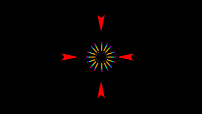
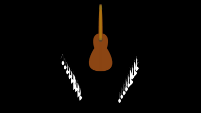

# Music Visualiser Project

Name: Maciej Golubski

Student Number: C19389881

## Instructions
- Fork this repository and use it a starter project for your assignment
- Create a new package named your student number and put all your code in this package.
- You should start by creating a subclass of ie.tudublin.Visual
- There is an example visualiser called MyVisual in the example package
- Check out the WaveForm and AudioBandsVisual for examples of how to call the Processing functions from other classes that are not subclasses of PApplet

# Description of the assignment
The assingement is based on the song Dancin(Krono Remix), its been really influential and a good hype song in the recent years of my life. Ive split the project into 3 different visuals, The first one is a visual of 
- 4 hearts eg. code for one of the hearts
 ```Java
public void render()
    {
        float halfwidth= mv.width/3;
        float halfheight= mv.height/3;
        for(int i = 0 ; i < mv.getBands().length ; i ++)
        {
            mv.smooth();
            mv.noStroke();
            mv.fill(PApplet.map(i, 255, mv.getBands().length, 255, 255), 255, 255);
            
            mv.beginShape();
            mv.vertex(halfwidth, halfheight);
            mv.bezierVertex(halfwidth, halfheight-20-mv.getSmoothedBands()[i] * 0.2f, halfwidth+40 +mv.getSmoothedBands()[i] * 0.2f, halfheight-10, halfwidth, halfheight+25+mv.getSmoothedBands()[i] * 0.2f);
            mv.vertex(halfwidth, halfheight);
            mv.bezierVertex(halfwidth, halfheight-20- mv.getSmoothedBands()[i] * 0.2f, halfwidth-40 -mv.getSmoothedBands()[i] * 0.2f, halfheight-10, halfwidth, halfheight+25+mv.getSmoothedBands()[i] * 0.2f);
            mv.endShape();
	 }
     }
```	
- 4 boxes with spheres inside them rotating 
```Java
for(int i = 0 ; i < mv.getBands().length ; i ++)
        {
            float halfwidth= mv.width/4;
            float halfheight= mv.height/4;
            float angle=0;
            mv.stroke(0, 0, 255);
            mv.noFill();

            mv.pushMatrix();
            mv.translate(halfwidth ,halfheight *3 , 0);
            angle = 0.02f ;
            mv.rotateX(angle+mv.getSmoothedBands()[1] *0.01f);
            mv.rotateY(angle+mv.getSmoothedBands()[1] *0.01f);
            mv.box(100);
            mv.popMatrix();
	}
```
```Java
for(int i = 0 ; i < mv.getBands().length ; i ++)
        {
            float halfwidth= mv.width/4;
            float halfheight= mv.height/4;

            mv.noStroke();
            mv.fill(140,140, 140);

            mv.pushMatrix();
            mv.translate(halfwidth ,halfheight *3 , 0);
            mv.sphere(5+ mv.getSmoothedBands()[i] *.1f);
            mv.popMatrix();
	  }
```
- Angel wings in the middle of the screen 
```Java 
public void render()
    {
        float halfwidth= mv.width/2;
        float halfheight= mv.height/2;
        for(int i = 0 ; i < mv.getBands().length ; i ++)
        {
            mv.smooth();
            mv.noStroke();
            mv.fill(PApplet.map(i, 0, mv.getBands().length, 0, 0), 0, 255);
            mv.beginShape();
            mv.vertex(halfwidth, halfheight);
            mv.bezierVertex(halfwidth, halfheight-20-mv.getSmoothedBands()[i] * 0.2f, halfwidth+40 +mv.getSmoothedBands()[i] * 0.2f, halfheight-10, halfwidth +mv.getSmoothedBands()[i] * 0.2f, halfheight+25+mv.getSmoothedBands()[i] * 0.2f);
            mv.vertex(halfwidth, halfheight);
            mv.bezierVertex(halfwidth, halfheight-20- mv.getSmoothedBands()[i] * 0.2f, halfwidth-40 -mv.getSmoothedBands()[i] * 0.2f, halfheight-10, halfwidth -mv.getSmoothedBands()[i] * 0.2f, halfheight+25+mv.getSmoothedBands()[i] * 0.2f);
            mv.endShape();
        }
    }   
```
- Circle signifying a halo.
```Java
public void render()
    {
        mv.colorMode(PApplet.HSB);
        for(int i = 0 ; i < mv.getAudioBuffer().size() ; i ++)
        {
            mv.stroke(
                PApplet.map(i, 0, mv.getAudioBuffer().size(), 0, 255)
                , 255
                , 255
            );

            mv.ellipse(mv.width/2, mv.height/5, cy + cy * mv.getAudioBuffer().get(i), cy + cy * mv.getAudioBuffer().get(i));
        }
    }
```
- Bars on the left and right hand side
```Java
 public void render()
    {
        float gap = mv.height / (float) mv.getBands().length;
        mv.noStroke();
        for(int i = 0 ; i < mv.getBands().length ; i ++)
        {
            mv.fill(PApplet.map(i, 0, mv.getBands().length, 255, 0), 255, 255);
            mv.rect(mv.width,i * gap,-mv.getSmoothedBands()[i] * 1.0f, gap); 
        
            mv.fill(PApplet.map(i, 0, mv.getBands().length, 255, 0), 255, 255);
            mv.rect(0,i * gap,mv.getSmoothedBands()[i] * 1.0f, gap); 
        }
    }
```
The 2nd visual is based on the idea of people telling you to do but you in the middle revolting against them and pushing back. 
- The circle in the middle with lines going out signifies revolting ( one side)
```Java
public void render()
    {
        float halfwidth= mv.width/2;
        float halfheight= mv.height/2;
        
        for(int i = 0 ; i < mv.getBands().length ; i ++)
        {
            mv.stroke(255);
            mv.noFill();
            mv.circle(halfwidth, halfheight, 100);
            mv.noStroke();
            mv.fill(PApplet.map(i, 0, mv.getBands().length, 255, 0), 255, 255);
            
            //far right
            mv.rect(halfwidth+60, halfheight-5, 40+mv.getSmoothedBands()[i] * 0.09f, 10);
            //far left
            mv.rect(halfwidth-60, halfheight-5, -40-mv.getSmoothedBands()[i] * 0.09f, 10);
            
            //top-right
            mv.pushMatrix();
            mv.translate(halfwidth+55,halfheight-20);
            mv.rotate(-60);
            mv.rect(0, 0, -40-mv.getSmoothedBands()[i] * 0.09f, 10);
            mv.popMatrix();

            mv.pushMatrix();
            mv.translate(halfwidth+45,halfheight-40);
            mv.rotate(+40);
            mv.rect(0, 0, -40-mv.getSmoothedBands()[i] * 0.09f, 10);
            mv.popMatrix();

            mv.pushMatrix();
            mv.translate(halfwidth+30,halfheight-55);
            mv.rotate(+90);
            mv.rect(0, 0, -40-mv.getSmoothedBands()[i] * 0.09f, 10);
            mv.popMatrix();
	 }
     }
```
The 3rd visual is based on a guitar and the subsequent notes coming out of it.
-Guitar 
```Java
for(int i = 0 ; i < mv.getBands().length ; i ++)
        {   
            mv.noStroke();
            mv.fill(255,255,255);    
            mv.translate(-20, 40);
            mv.beginShape();
            mv.vertex(halfwidth+360, halfheight-20);
            mv.bezierVertex(halfwidth+360, halfheight-20-mv.getSmoothedBands()[i] * 0.09f, halfwidth+361 +mv.getSmoothedBands()[i] * 0.09f, halfheight+40 , halfwidth+361, halfheight+40 +mv.getSmoothedBands()[i] * 0.09f);
            mv.vertex(halfwidth+361, halfheight+40);
            mv.bezierVertex(halfwidth+361, halfheight+40 +mv.getSmoothedBands()[i] * 0.09f, halfwidth+330 +mv.getSmoothedBands()[i] * 0.09f, halfheight+60, halfwidth+360, halfheight+80 +mv.getSmoothedBands()[i] * 0.09f);

            mv.vertex(halfwidth+360, halfheight-20);
            mv.bezierVertex(halfwidth+360, halfheight-20-mv.getSmoothedBands()[i] * 0.09f, halfwidth+359 +mv.getSmoothedBands()[i] * 0.09f, halfheight+40, halfwidth+359, halfheight+40 +mv.getSmoothedBands()[i] * 0.09f);
            mv.vertex(halfwidth+359, halfheight+40);
            mv.bezierVertex(halfwidth+359, halfheight+40 +mv.getSmoothedBands()[i] * 0.09f, halfwidth+390 +mv.getSmoothedBands()[i] * 0.09f, halfheight+60, halfwidth+360, halfheight+80 +mv.getSmoothedBands()[i] * 0.09f);
            mv.endShape();

            mv.stroke(255,255,255);
            mv.noFill(); 
            mv.line(halfwidth+360,halfheight-20 -mv.getSmoothedBands()[i] * 0.09f,halfwidth+380,halfheight+20);
        }
```
- Music Symbol
```Java
for(int i = 0 ; i < mv.getBands().length ; i ++)
        {   
            mv.noStroke();
            mv.fill(255,255,255);  
            
            mv.translate(-20,-40);      
            mv.beginShape();

            mv.vertex(halfwidth, halfheight-20);
            mv.bezierVertex(halfwidth, halfheight-20-mv.getSmoothedBands()[i] * 0.09f, halfwidth-1 +mv.getSmoothedBands()[i] * 0.09f, halfheight+40 , halfwidth-1, halfheight+40 +mv.getSmoothedBands()[i] * 0.09f);
            mv.vertex(halfwidth-1, halfheight+40);
            mv.bezierVertex(halfwidth-1, halfheight+40 +mv.getSmoothedBands()[i] * 0.09f, halfwidth+30 +mv.getSmoothedBands()[i] * 0.09f, halfheight+60, halfwidth, halfheight+80 +mv.getSmoothedBands()[i] * 0.09f);

            mv.vertex(halfwidth, halfheight-20);
            mv.bezierVertex(halfwidth, halfheight-20-mv.getSmoothedBands()[i] * 0.09f, halfwidth+1 +mv.getSmoothedBands()[i] * 0.09f, halfheight+40, halfwidth+1, halfheight+40 +mv.getSmoothedBands()[i] * 0.09f);
            mv.vertex(halfwidth+1, halfheight+40);
            mv.bezierVertex(halfwidth+1, halfheight+40 +mv.getSmoothedBands()[i] * 0.09f, halfwidth-30 +mv.getSmoothedBands()[i] * 0.09f, halfheight+60, halfwidth, halfheight+80 +mv.getSmoothedBands()[i] * 0.09f);
            mv.endShape();

            mv.stroke(255,255,255);
            mv.noFill(); 
            mv.line(halfwidth,halfheight-20 -mv.getSmoothedBands()[i] * 0.09f,halfwidth-20,halfheight+20);
        }
```
# Instructions
To operate the programme you simply open it up and can move to different visuals using 1, 2 or 3.
# How it works
- Visual 1 is accessed by pressing 1
- Visual 2 is accessed by pressing 2 
- Visual 3 is accessed by pressing 3
# What I am most proud of in the assignment
###### In Visual 1
There is a lot that i am proud of in this project i feel that the spacing of different objects in Visual 1 is perfect
as the spacing doesnt collide with anything and makes the screen feel full and exciting. 

###### In Visual 2 
I am proud of the rotations that i have done around the circle. 

###### In Visual 3 
I am proud of the guitar itself. I had to use a vertexes and beginShape() in order to make the guitar work and look good.


This is a youtube video of the project:

[](https://youtu.be/We_sdcYDPwo)
