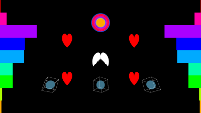

# Music Visualiser Project

Name: Maciej Golubski

Student Number: C19389881

## Instructions
- Fork this repository and use it a starter project for your assignment
- Create a new package named your student number and put all your code in this package.
- You should start by creating a subclass of ie.tudublin.Visual
- There is an example visualiser called MyVisual in the example package
- Check out the WaveForm and AudioBandsVisual for examples of how to call the Processing functions from other classes that are not subclasses of PApplet

# Description of the assignment
The assingement is based on the song Dancin(Krono Remix), its been really influential and a good hype song in the recent years of my life. Ive split the project into 3 different visuals, The first one is a visual of 4 hearts, 4 boxes with spheres inside them rotating with angel wings in the middle of the screen and a circle signifying a halo.
The 2nd visual is based on the idea of people telling you to do but you in the middle revolting against them and pushing back.
The 3rd visual is based on a guitar and the subsequent notes coming out of it.
# Instructions
To operate the programme you simply open it up and can move to different visuals using 1, 2 or 3.
# How it works
- Visual 1 is accessed by pressing 1
- Visual 2 is accessed by pressing 2 
- Visual 3 is accessed by pressing 3
# What I am most proud of in the assignment
###### In Visual 1
There is a lot that i am proud of in this project i feel that the spacing of different objects in Visual 1 is perfect
as the spacing doesnt collide with anything and makes the screen feel full and exciting. 

###### In Visual 2 
I am proud of the rotations that i have done around the circle. 

###### In Visual 3 
I am proud of the guitar itself. I had to use a vertexes and beginShape() in order to make the guitar work and look good.

# Markdown Tutorial

This is *emphasis*

This is a bulleted list

- Item
- Item

This is a numbered list

1. Item
1. Item

This is a [hyperlink](http://bryanduggan.org)

# Headings
## Headings
#### Headings
##### Headings

This is code:

```Java
public void render()
{
	ui.noFill();
	ui.stroke(255);
	ui.rect(x, y, width, height);
	ui.textAlign(PApplet.CENTER, PApplet.CENTER);
	ui.text(text, x + width * 0.5f, y + height * 0.5f);
}
```

So is this without specifying the language:

```
public void render()
{
	ui.noFill();
	ui.stroke(255);
	ui.rect(x, y, width, height);
	ui.textAlign(PApplet.CENTER, PApplet.CENTER);
	ui.text(text, x + width * 0.5f, y + height * 0.5f);
}
```

This is an image using a relative URL:


This is an image using an absolute URL:


This is a youtube video:

[](https://www.youtube.com/watch?v=J2kHSSFA4NU)

This is a table:

| Heading 1 | Heading 2 |
|-----------|-----------|
|Some stuff | Some more stuff in this column |
|Some stuff | Some more stuff in this column |
|Some stuff | Some more stuff in this column |
|Some stuff | Some more stuff in this column |

